# Olá! bem vindo ao github de Marcus Vinícius:

--- 
## Métricas

---
## Linguagens

---
## Commits

---

## Sobre Mim

- 🌱 **Estudando:** Bacharelado em Sistemas de Informação
- 👨 **Focado em:** Desenvolvimento Web e Mobile
- 📍 **Localização:** Brasil

---

## Tecnologias & Ferramentas

  
  
  
  
  

---

## Outras Redes

  
  
  

